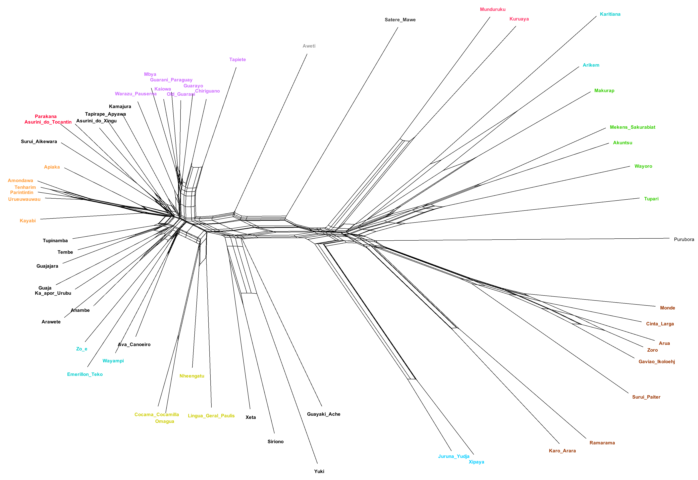
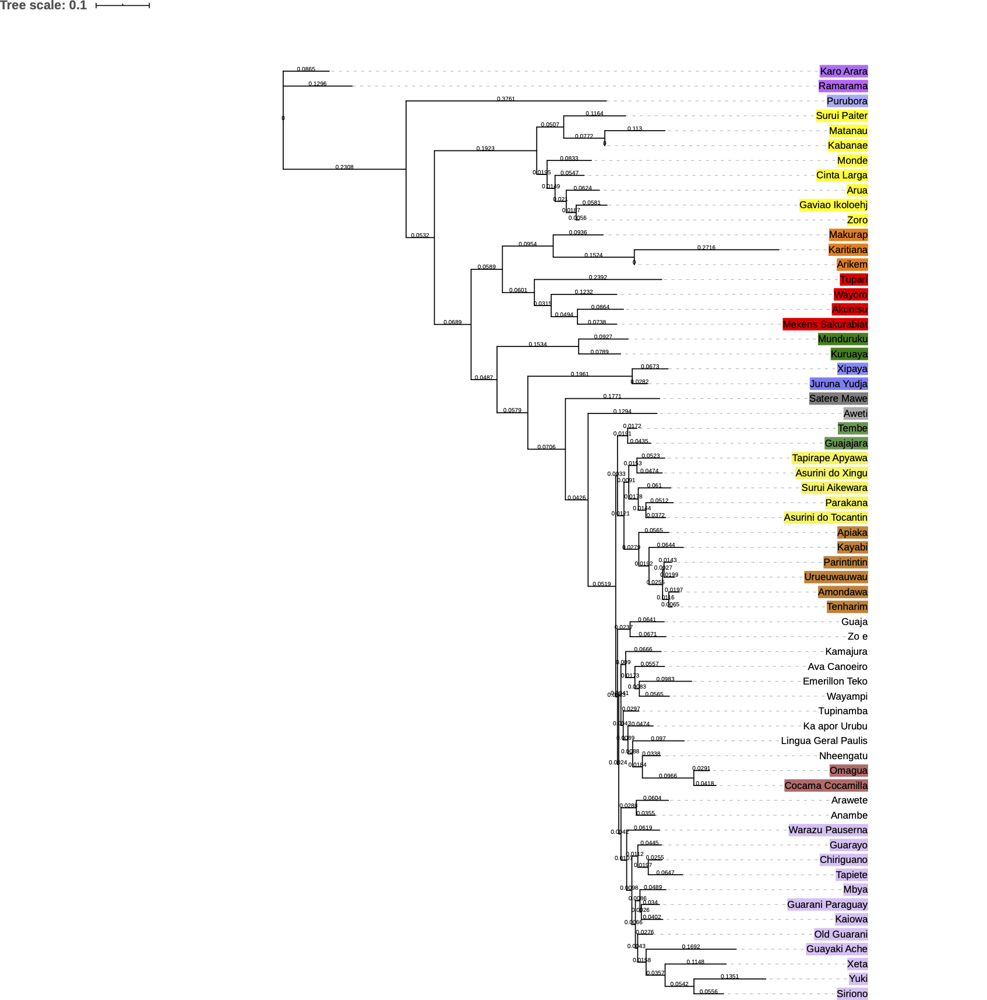

```{r setup, include=FALSE}
knitr::opts_chunk$set(echo = TRUE)

```

<style>
a:link {
    color: #0b99e0;
}
 a:hover {
    color: #4dbef7;
}
.list-group-item.active, .list-group-item.active:focus, .list-group-item.active:hover {
    z-index: 2;
    color: #fff;
    background-color: #0b99e0;
    border-color: #0b99e0;
}
</style>


## Geographical distances between Tupían languages  
##### Author: Tim Wientzek
The underlying data to create a tree of geographical distances between Tupían languages consists of the longitudes, latitudes and subfamilies of the respective doculects in [TuLeD](http://tuled.org). The R packages “geosphere”, “ape” and “phytools” [1-4] were then used to create a matrix of geographical distances and draw a corresponding tree which is structured based on the neighbor-joining algorithm [5] and has been ladderized. For the calculation of the distances, the implementation of the Vincenty Formulae [6], which is said to have a maximum error of 0.5 mm for distances between any points on the globe, was selected from the “geosphere” package.
The smallest calculated distance is 15.08 km between the coordinates of Kamayura and Awetí - at least if the distance between Zoró and Gavião is not considered as they share the same coordinates. Conversely, the largest distance is 4344.43 km between Cocama-Cocamilla and Tupinambá.
  

  
### References
[1] R Core Team (2019). R: A language and environment for statistical computing. R Foundation for Statistical Computing, Vienna,
  Austria. URL https://www.R-project.org/.  
[2] Hijmans, R. J. (2019). geosphere: Spherical Trigonometry. R package version 1.5-10. https://CRAN.R-project.org/package=geosphere  
[3] Paradis E. & Schliep K. (2018). ape 5.0: an environment for modern phylogenetics and evolutionary analyses in R. Bioinformatics 35:
  526-528.  
[4] Revell, L. J. (2012). phytools: An R package for phylogenetic comparative biology (and other things). Methods Ecol. Evol. 3 217-223.
  doi:10.1111/j.2041-210X.2011.00169.x  
[5] Saitou, N. & Nei, M. (1987). The neighbor-joining method: a new method for reconstructing phylogenetic trees. Molecular Biology and Evolution, Vol.4(4): 406–425
[6] Vincenty, T. (1975a). Direct and inverse solutions of geodesics on the ellipsoid with application of nested equations. Surv Rev 23(176): 88–93

---

## NeighbourNet
##### Author: Fabrício Ferraz Gerardi
In order to search for any conflicting signal (different possible evolutionary trajectories) in the data, these are indicative of gene genesis, loss and duplication events, hybridization, horizontal gene transfer or recombination. For this, SPLITSTREE v. 4.16.1 [1] is used to generate a NeighborNet network. This involves transforming a character matrix into a distance matrix and using the latter to estimate splits. Languages for which data is scarse in the database have not been included.
  

  
### References
[1] R Core Team (2019). R: D. H. Huson and D. Bryant, Application of Phylogenetic Networks in Evolutionary Studies, Mol. Biol. Evol., 23(2):254-267, 2006. [SplitsTree](http://www.splitstree.org/).

---

## Tree from maximum-likelihood analysis
##### Author: Fabrício Ferraz Gerardi




---

## Intersection of Kabanae and Matanau with Tupían language families
##### Author: Tim Wientzek
To see which language family Kabanae and Matanau most probably belong to, it was calculated how many cognates they have in common with the respective language families. The results show that both have the highest intersection of cognates with languages from the Mondé family.


_Note: Values indicate the number of intersections between Kabanae/Matanau and the language families, divided by the total number of COGIDs for Kabanae/Matanau. Ex.: Kabanae (at this time) has a total of 41 COGIDs, of which 17 are also found among doculects of the Munduruku family. Hence, 17/41 = 0.41._


<div style="position: bottom; bottom:0; left:0; padding: 50px;">
  [{#id .class width=292 height=75 style="vertical-align:middle;margin:0px 30px"}](https://uni-tuebingen.de/) 
  [{#id .class width=130 height=130}](https://erc.europa.eu/)
</div>


